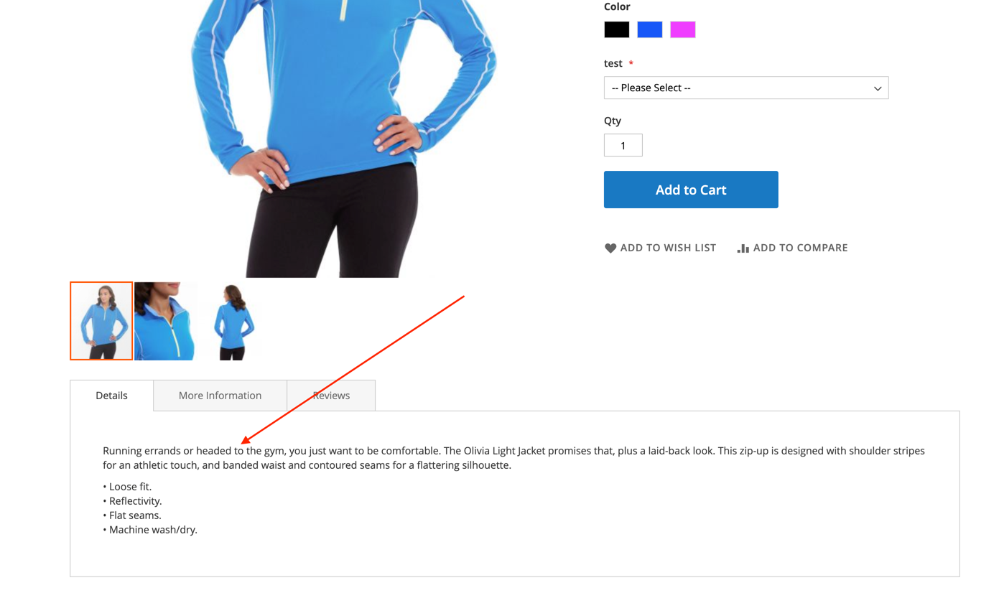
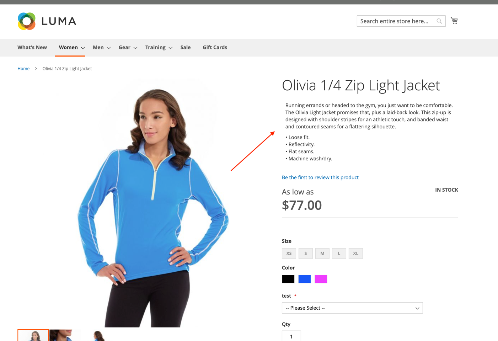

***ReadyToGo_ProductDescription***

_Task:_ move a product description block to product info section

_Before:_

_After:_

**To enable this module execute:**

- `composer require eugene-petrov/magento2-product-description`
or if the cmd above is not working: `composer config repositories.readyToGoProductDescription vcs git@github.com:eugene-petrov/magento2-product-description.git`
- `php bin/magento setup:upgrade`
- `php bin/magento cache:clean`

